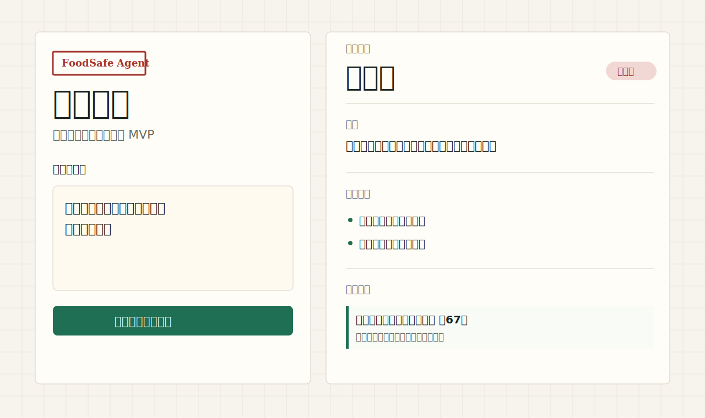

# FoodSafe Agent / 食安智问

面向食品企业标签审版与法规咨询的可溯源合规问答 MVP。项目聚焦“预包装食品标签合规”：输入食品标签、配料、营养声称或法规问题，系统检索结构化法规条款，输出风险等级、整改建议和引用依据；知识库外问题会拒答。



## 项目亮点

- 食品专业场景：围绕预包装食品标签合规，而不是泛化聊天问答。
- 可溯源回答：每个结论必须带法规/标准名称、条款、摘要和来源链接。
- 可复现风险判断：用条款 `risk_level` 和少量显式规则做风险分级，避免模型凭记忆判断。
- 拒答机制：未命中知识库的问题返回“待人工核验”，不编造法规结论。
- 稳定展示：静态 Web Demo，可部署到 GitHub Pages，不依赖 Streamlit、后端服务或外部 API。
- 可评测：内置 30 条结构化法规条款和 30 条黄金测试问题，自动化测试覆盖核心场景。

## 快速体验

### Web Demo

本地直接打开：

```text
web/index.html
```

或者打开根目录 `index.html`，它会跳转到 Web Demo。

网页支持：

- 标签/法规问题输入
- 示例问题一键填入
- 风险等级展示
- 整改建议
- 引用条款展开
- 按风险类型筛选引用依据

### CLI

要求 Python 3.10+，无第三方依赖。

```powershell
python foodsafety_agent.py "预包装饼干没有标生产日期，可以销售吗？"
python foodsafety_agent.py "执行标准的年代号能否不写？" --json
python -m unittest discover -s tests -v
```

如果系统 `python` 指向 WindowsApps 占位程序，可直接用项目脚本：

```powershell
.\run.ps1 "预包装饼干没有标生产日期，可以销售吗？"
.\run.ps1 "执行标准的年代号能否不写？"
.\run.ps1 "冷链车应该使用哪种压缩机？"
```

## 演示问题

| 问题 | 预期行为 |
|---|---|
| 预包装饼干没有标生产日期，可以销售吗？ | 高风险；返回食品安全法和 GB 7718 相关依据。 |
| 执行标准的年代号能否不写？ | 需核验；返回 GB 7718-2025 相关依据。 |
| 食品标签字体太小但内容都写了，可以吗？ | 返回标签清晰、醒目、易识读相关依据。 |
| 冷链车应该使用哪种压缩机？ | 知识库外问题，拒答并提示人工核验。 |

## 测试结果

```powershell
python -m unittest discover -s tests -v
```

当前覆盖：

- 3 个核心回归样例
- 30 条黄金测试问题
- 黄金问题字段完整性
- 黄金问题风险等级与引用返回

预期结果：

```text
Ran 5 tests
OK
```

## 架构

```text
用户问题
  -> 关键词 / 主题 / 标题检索
  -> 命中结构化法规条款
  -> 条款风险等级 + 显式规则
  -> 结构化报告
  -> 引用依据 / 整改建议 / 拒答
```

主要文件：

- `foodsafety_agent.py`：离线检索、风险判断、CLI 输出。
- `data/regulations.json`：检索器可直接读取的 30 条法规条款。
- `data/regulations.full.json`：TeleAgent 收集的完整结构化法规知识库。
- `data/golden_questions.json`：30 条黄金测试问题。
- `web/`：静态作品集演示页，适合 GitHub Pages。
- `tests/`：核心样例与黄金问题验收。
- `docs/regulation-audit.md`：法规数据核验清单。
- `docs/deployment.md`：GitHub Pages 部署说明。

## 为什么不先做大模型套壳

食品合规问答的关键不是“回答像不像”，而是：

- 是否能引用依据
- 是否能说明适用范围
- 是否能稳定复现风险判断
- 是否能在没有证据时拒答
- 是否能让质量/法规人员复核

因此 MVP 先做“规则 + 检索 + 强制引用”的离线闭环，再预留 LLM 接口。后续 LLM 只负责基于已检索证据组织语言，不负责凭模型记忆给法规结论。

## 部署

详见 [docs/deployment.md](docs/deployment.md)。

推荐部署到 GitHub Pages：根目录 `index.html` 会自动跳转到 `web/index.html`。

## 边界

这是求职作品集 MVP，不是正式法规数据库或法律意见。样例知识库仅含演示级条款摘要，真实部署必须获取授权/公开的标准全文，建立生效日期、废止/替代关系、产品类别、法规更新和人工复核机制。

法规来源和待核验项见 [docs/regulation-audit.md](docs/regulation-audit.md)。

## 后续路线

- 扩充 GB 7718、GB 28050、GB 2760 的经授权/公开语料。
- 给每条法规增加精确条款位置、版本关系和适用产品类别。
- 引入 BM25 + 向量混合检索和 reranker。
- 接入可替换 LLM，但强制答案只能使用检索上下文。
- 增加引用一致性校验、冲突条款提示、人工复核队列和审计日志。
